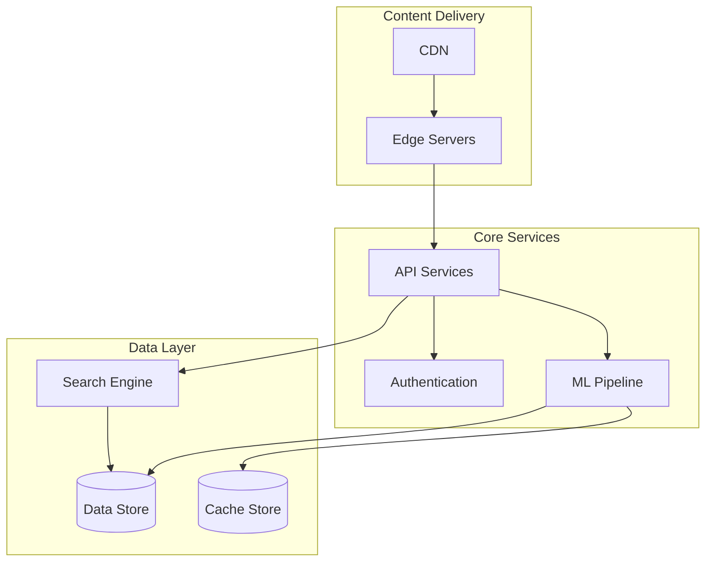

# HotFlicks Platform

## Overview

HotFlicks is a case study project demonstrating the architecture and implementation of a distributed, scalable video streaming platform. Modeled after industry-leading streaming services, this project showcases modern cloud-native architectures, machine learning integration, and microservices design patterns.

## Project Purpose

This project serves as an educational and reference implementation for:

- Large-scale Kubernetes deployments
- Distributed ML systems
- Microservices architecture
- High-performance video streaming
- Real-time recommendation engines
- Cloud-native development practices

## Architecture

## Key Features

- Distributed video streaming with edge caching
- ML-powered content recommendations
- Real-time search capabilities
- High-availability service architecture
- Scalable data processing pipeline
- Comprehensive monitoring and logging
- Security-first design approach

## Technologies Used

HotFlicks implements purpose-based architecture using industry-standard technologies:

| Purpose                 | Implementation |
| ----------------------- | -------------- |
| Service Registry        | Consul         |
| Secret Management       | Vault          |
| Data Storage            | PostgreSQL     |
| Caching                 | Redis          |
| Search                  | Meilisearch    |
| Message Queue           | RabbitMQ       |
| Metrics                 | Prometheus     |
| Visualization           | Grafana        |
| Load Balancing          | HAProxy/NGINX  |
| Container Orchestration | Kubernetes     |

## Service Configuration

All service configurations are located in:
`cache/conf/`

## Deployment

Services are deployed using Kubernetes, with manifests located in:
`automation/runtime/core/`

## Documentation

- [Configuration Guide](docs/configuration/README.md) - Detailed service configuration instructions
- [Deployment Guide](docs/deployment/README.md) - Deployment procedures and requirements
- [Development Guide](docs/development/README.md) - Development setup and guidelines

## Project Structure

.
├── automation/ # Kubernetes and deployment automation
├── cache/ # Service configurations
├── docker/ # Service implementations
├── docs/ # Documentation
└── scripts/ # Utility scripts

## Getting Started

1. Clone the repository
2. Install prerequisites (see [Development Guide](docs/configuration/README.md))
3. Configure your environment
4. Deploy the platform

## Contributing

See [Development Guide](docs/development/README.md) for contribution guidelines.

## License

[License details to be added]
